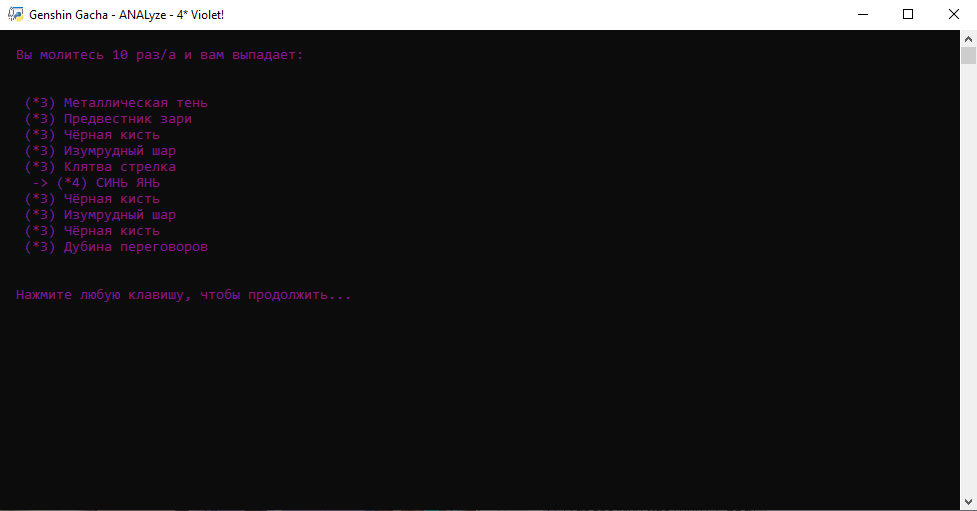

# Genshin Gacha ANALyze/Simulator

Gacha simulator/analyzer

## Requirements

```
Python 3
windows terminal
pip install tqdm
```

## About

Simple gacha simulator from Genshin Impact. All chances are official, but to get closer to 1.6% and 13%. I create my own soft pity system.

## Screenshots




